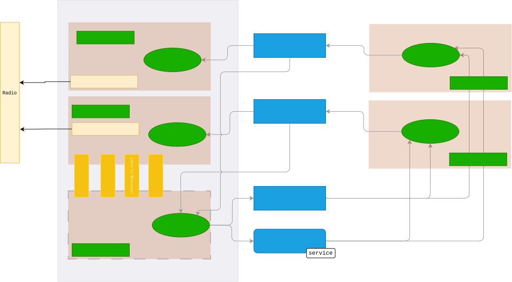

# Multi-Agent Deployment

The multi-agent real-world setup uses a host-client architecture. One host machine connects to all
Crazyflies and supervises the race, while each client process runs one controller for one drone
rank and communicates with the host over ROS2/Zenoh.

## Required Processes

For a multi-drone race, you typically need these processes:

1. One Zenoh router on the host machine.
2. One motion capture node on the host machine.
3. One estimator process per drone.
4. One host deployment script on the host machine.
5. One client deployment script per drone, either on the host machine or on the students'.

## Pixi Commands

Start all terminals in the `deploy` environment:

```bash
pixi shell -e deploy
```

On the host machine, start the Zenoh router:

```bash
pixi run -e deploy zenoh-router
```

Start motion capture tracking:

```bash
pixi run -e deploy mocap
```

Start one estimator per drone:

```bash
pixi run -e deploy estimator --drone_name cfXX
```

Then launch the host process:

```bash
python scripts/multi_deploy_host.py --config multi_level2.toml
```

On each client machine, launch one client process with its drone rank:

```bash
python scripts/multi_deploy_client.py --config multi_level2.toml --drone_rank 0
python scripts/multi_deploy_client.py --config multi_level2.toml --drone_rank 1
```

If you want to override the controller file from the config for a single client, pass
`--controller <controller_name.py>` to `multi_deploy_client.py`.

!!! note
    The `drone_rank` must match the order of drones in `deploy.drones` in the config file.
    Rank `0` controls the first drone, rank `1` the second, and so on.

## Environments

Two different runtime environments are involved during deployment:

- `lsy_drone_racing.envs.real_race_host_env.CrazyflieRealRaceHost` runs on the host machine. It checks the real track, spawns one worker process per drone, waits for all clients to become ready, calibrates clocks, starts the race, and coordinates shutdown and return-to-start.
- `lsy_drone_racing.envs.real_race_client_env.RealMultiDroneRaceEnvClient` runs on each client. It mirrors the multi-drone Gymnasium interface, reads local estimator state, tracks visited gates and obstacles, waits for the host start signal, and forwards the controller action for its own rank.

## Host And Client Scripts

The deployment scripts are thin wrappers around those environments:

- `scripts/multi_deploy_host.py` loads the multi-drone config, updates and checks real poses from motion capture, connects to all drones, and enters the host coordination loop.
- `scripts/multi_deploy_client.py` loads the controller for one `drone_rank`, creates the client environment, waits for the host to start the race, and runs the local control loop at the configured frequency.


<div align="center">
  
</div>

## Startup Sequence

The startup order matters:

1. Start `zenoh-router`.
2. Start `mocap`.
3. Start all estimator processes.
4. Start the host script.
5. Start all client scripts.

Once the host is running, it repeatedly publishes a ready signal. Each client waits for that
signal, calibrates its clock against the host, marks itself as ready, and blocks until the host
releases the synchronized race start. During the race, clients send actions to the host and the
host-side worker processes forward those actions to the physical drones.
